# PR Lens

Review what actually matters. PR Lens renders a pull request as beautiful, animated diagrams **inside the GitHub pull request itself** — architecture blast radius and data-flow pipelines, not another findings table.


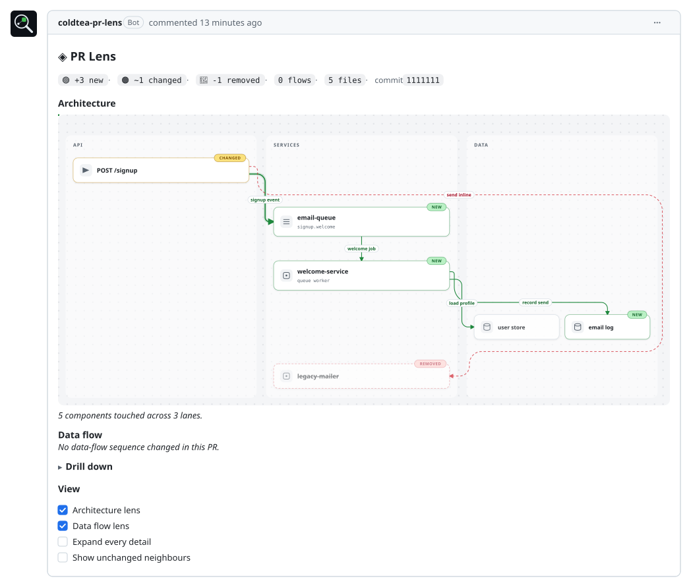

<sub>This is what lands in your pull request — a bot comment, drawn here card and all. Green is new, amber changed, red gone, and the pulse is the data moving along the new path.</sub>



<sub>The reference pull request's complete comment — both lenses, real composer text, in both themes: dark above, light below. Every render ships as a dark/light pair; the live comment serves the pair behind a `<picture>` tag so each reader automatically sees the one matching their GitHub theme.</sub>

Two lenses ship: **architecture** (what this change touches, against the existing system) and **data flow** (the ordered pipeline, animated). Every diagram on this page was rendered by this repo's renderer from a JSON document in this repo — this page *is* the product demo.

## From one card to a monorepo

The renderer answers for every size of change with the same visual grammar: lanes, node cards, delta colours, and routes you can trace with the eye alone.

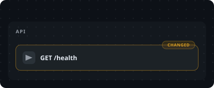

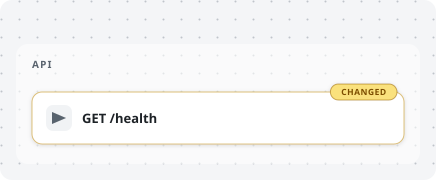

<sub>The smallest honest diagram — 1 lane · 1 node · 0 edges.</sub>

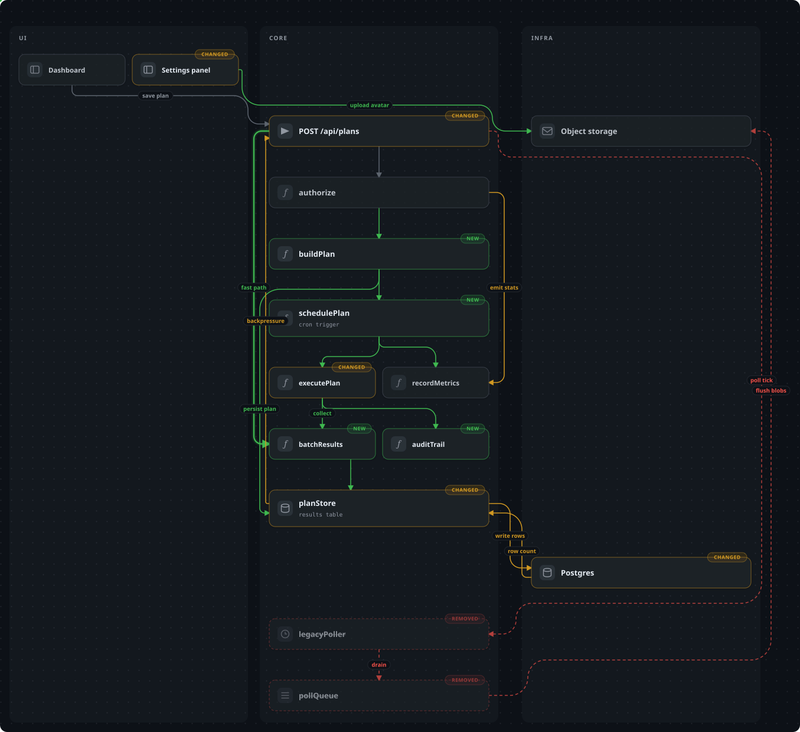

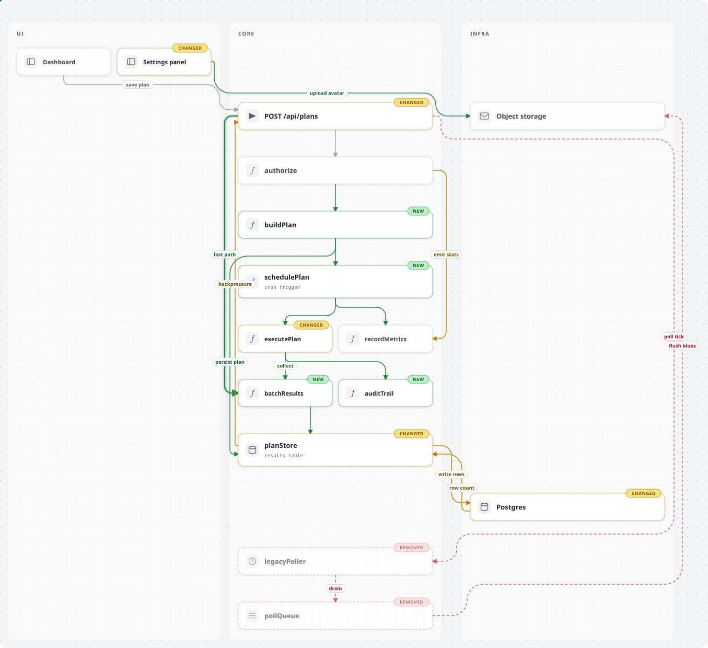

<sub>The dense synthetic — 3 lanes · 15 nodes · 19 edges. Crossings happen inside corridors and read as wiring, not spaghetti.</sub>

<details>
<summary><b>Tier 4 — a checkout flow</b> · 5 lanes · 21 nodes · 24 edges</summary>
<br>
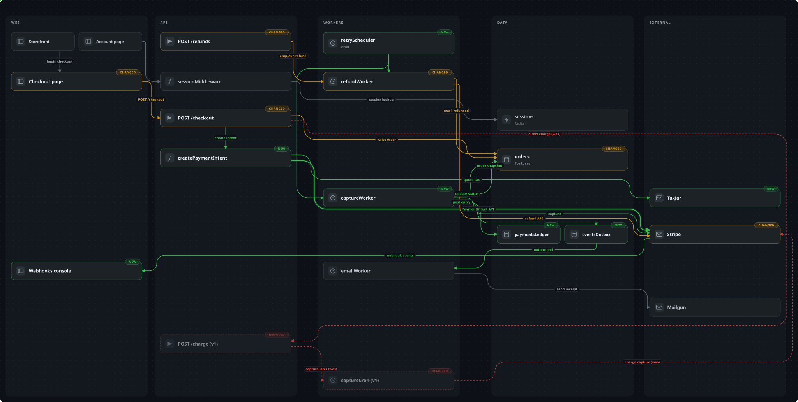

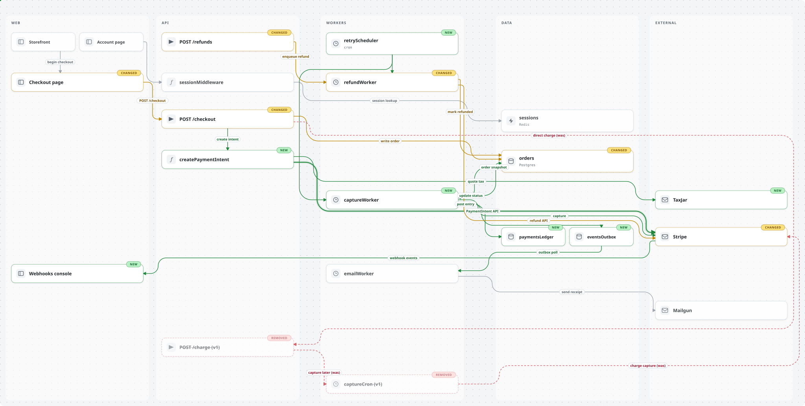
</details>

<details>
<summary><b>Tier 5 — a monorepo</b> · 6 lanes · 37 nodes · 49 edges</summary>
<br>


</details>

<sub>Collapsed tiers dogfood the same `<details>` drill-down pattern the PR comment uses.</sub>

## The data-flow lens

The ordered pipeline of the change, drawn in the same design system — participants are real node cards, labels are the same pills, colours are the same deltas. **The pulses are moving right now**: PR Lens diagrams are animated SVG, and the animation survives GitHub's image proxy — a hook no findings table has.



<sub>The reference pull request's send pipeline — 7 steps on one shared clock, pulses travelling in the order the steps happen.</sub>



<sub>Every message kind at once: a filled head waits for an answer, an open head is fire-and-forget, a dashed line *is* the answer — and only waited-on work lights an activation bar.</sub>

Every render above comes from a checked-in fixture — the [teaser](docs/showcase/teaser.ts), the [reference pull request](packages/schema/src/examples/postmark-refactor.ts), the [dense synthetic](packages/renderer/test/dense.ts), the [upper tiers](packages/renderer/test/fixtures), the [mixed-kinds flow](packages/renderer/test/mixed-kinds.ts) — regenerated deterministically by [`docs/showcase/render.mts`](docs/showcase/render.mts), and the comment mockups up top are framed by [`docs/showcase/frame.ts`](docs/showcase/frame.ts) around the same renders, with the composer's real text.

## Packages

| Package | What it is |
| --- | --- |
| [`packages/schema`](packages/schema) | `@coldtea/pr-lens-schema` — the contract every other component speaks |
| [`packages/renderer`](packages/renderer) | `@coldtea/pr-lens-renderer` — deterministic JSON graph → the animated, theme-paired SVGs on this page |
| [`packages/cli`](packages/cli) | `@coldtea/pr-lens-cli` — read a diff with your own model key, render it, compose the comment |
| [`packages/action`](packages/action) | the GitHub Action: analyze, publish, post one static comment |
| [`packages/agent-skill`](packages/agent-skill) | `@coldtea/pr-lens-agent-skill` — teaches a coding agent to draw the change it just made |

## Working in this repo

```bash
pnpm install
pnpm verify      # build, typecheck, test
```

Node 20.11+ and pnpm 10.

## TODO — end-to-end tests, in plain English

These are the visual guarantees this product makes. They are written here as English-language end-to-end tests, to be implemented later with agent-driven QA tooling — the infrastructure does not exist yet, and nothing here needs building today. Every one of them either shipped as a founding requirement or was earned by fixing a real regression; none may quietly break. The renderer's congestion behaviors have deeper, zoom-level specs in [`packages/renderer/test/e2e-specs.md`](packages/renderer/test/e2e-specs.md) — the entries below reference rather than repeat them.

### In a real GitHub pull request

1. **The pulses move.** Open a PR that PR Lens has commented on: the animated dots travel along the data-flow edges inside the comment itself. (SMIL must survive GitHub's image proxy and the `` context.)
2. **The drill-down actually renders.** Expand every `<details>` section in the comment: file links, code spans, and nested lists appear as rendered links and code — never as literal `- [path](url)` text. Must be checked through GitHub's own rendering at real nesting depth; a shallow probe passes while the real shape fails.
3. **The diagram matches the reader's theme.** View the comment in GitHub dark mode and light mode: the dark and light diagram variants appear respectively, and both are fully legible.
4. **One comment, always current.** Push to the PR repeatedly: there is only ever one PR Lens comment, updated in place, and the images always show the latest push — never a stale cached diagram.
5. **Checkboxes work without re-analysis.** Toggle a view-option checkbox: the comment re-renders within seconds from the stored graph, and toggling back restores the original view.
6. **A forged marker does nothing.** Post a human comment containing a copy of the sticky-comment state marker: PR Lens must never edit, delete, or honor that comment. Only the bot's own comment is ever touched.
7. **Model text cannot phish or ping.** Feed a PR whose code contains URLs, emails, and `@names` in identifiers and strings: none of them autolink, none become notifying mentions, and no label or summary can smuggle a clickable link into the comment.
8. **Permalinks land true.** Click a file link in the drill-down: it opens the exact lines at the analyzed commit, even after later pushes.
9. **The footer behaves.** The "Rendered by PR Lens" footer is present by default and absent when branding is disabled.

### The diagram's visual grammar

10. **The right line for the job.** On the reference graph: aligned neighbors are connected by dead-straight lines, and only routes that travel are curved — the curve set is exactly the known five (enqueue, batch size, the hero, the fan, the exiled dead path). A render where everything curves, or a neighbor's line bends, is broken.
11. **No crossings in open space.** No edge crosses another over the open canvas; where crossings must exist they happen inside corridors and read as wiring, not spaghetti.
12. **The dead path never touches the living graph.** Removed cards sit in their own band below everything alive; a dashed edge with one living end travels around the outside of the diagram, never through it; an edge between two removed cards stays inside the band.
13. **Stems are honest.** Where sibling edges share a trunk, it departs from one shared port, carries a single delta color, and fans out without any branch crossing another. A stem that braids at its junction is a regression.
14. **Arrivals are square.** Every edge meets its card perpendicular to the face it touches.
15. **Delta colors never lie.** Added is green, changed is amber, removed is red, dashed and ghosted — uniformly along each stroke, never mixed, on every tier.
16. **Any flow is traceable.** On the dense and stress fixtures, pick any single edge and follow it end-to-end with the eye alone — it never merges into a neighbor or disappears under anything. (Zoom-level detail: renderer specs 1–3.)
17. **Labels are readable, owned, and complete.** Every labelled edge shows exactly one pill; no pill hides another; each pill visibly belongs to one line. (Renderer specs 1–2.)

### Stability and self-containment

18. **Determinism is absolute.** Render the same graph twice: identical bytes. Rename a node: nothing else moves. Add one node: no card jumps — only small, proportionate shifts.
19. **Congestion handling never moves the uncongested.** The minimal fixture is pixel-identical across renderer changes; on the reference graph, cards never move and only crowded pills may shift, along their own lines. (Renderer spec 4.)
20. **The SVG stands alone.** No scripts, no external fonts or fetches, nothing clipped at the canvas edge, and the whole diagram — animation included — works when loaded through a plain `` tag. (Renderer specs 5–6.)

## License

MIT © Ohans Emmanuel.
